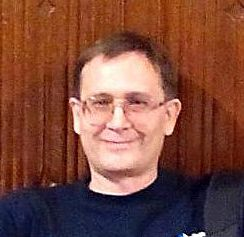

# Valentine Garbuzenko (@NickFallman)

## Contents
* Contacts
* My credo
* Job status
* Milestones
* Skills and devtools
* Code examples
* Projects
* Graduation
* Languages

## Contacts
- Mobile: +375 29 7682306
- E-mail: [nickf@tut.by](nickf@tut.by)
- Viber: +375297682306
- WhatsApp: +375297682306
- LinkedIn: [My Linkedin Page](https://www.linkedin.com/in/valentine-garbuzenko-46134341/)

## My credo
_"If something can be automated, it must be automated"._  
_"No limits for excellence"._
### Favorite movie: ...

## Job status
Looking for a new, productive, stable and interesting job.

## Milestones
**1991** Electronics engineer, system programmer. Programming languages: ASM i51, ASM i86, Borland Pascal, Delphi (Pascal), C.  Employer – Scientific Reserch Institute of Applied Physical Problems (Belarus).

**1993** Programmer, Graphics design, Image processing, Computer nesting for publishing.  Employer – Belprint Ltd. (Belarus).

**1996** Operator of digital printing machine. Image processing on Mac computer.  Employer – Belaya Vezha Ltd. (Kodak, Belarus).

**1996** Head of IT department, System administrator. Industrial Automation. Industrial communications. Programming languages: Delphi (Pascal), C, Asm.
 Employer – Aquar Ltd. (Belarus).

**1998** Deputy Director, System administrator. Industrial Automation. Industrial communications. Programming languages: Delphi (Pascal), C, C++, Asm.
 Employer – Aquar Ltd. (Belarus).

**2001** Head of IT department, System administrator, DevOps operations. Industrial Automation. Industrial communications. Embedded microprocessor equipment. Brend developing, graphics design, prepress nesting, polygraphy for exibitions. Programming languages: Delphi (Pascal), C, C++, Asm.  Employer – Aquar-System Ltd. (Belarus).

**2006** Leading System Engineer, System administrator, DevOps operations. Industrial Automation. Industrial communications. Brend developing, graphics design, prepress nesting, polygraphy for exibitions. Programming languages: Delphi (Pascal), C, Asm.  Employer – Aquar-System Ltd. (Belarus).

**2009** Self-employed entrepreneur, Cisco Account Manager, Cisco Presales Engineer, Sales Manager. Trade in computer equipment. Website developing, brend developing, graphics design.  In cooperation with – LD Systems company (Belarus).

↓ ¯\\\_(ツ)\_/¯ _I'm sorry. The sections below under construction._ ¯\\\_(ツ)\_/¯ ↓

_and so on..._

## Skills and devtools
### Graphics Design and Publishing:
### Code develope tools:

## Code examples
### Asm i51 example:
### C# example:

## Projects
todo: Andritz Belgosles RFID driveBOSS COSS (with links)

↑ ¯\\\_(ツ)\_/¯ _I'm sorry. The sections above under construction._ ¯\\\_(ツ)\_/¯ ↑

## Graduation (including courses and training)
- **1984-1991** Belarusian State University, Radiophysics and Electronics Department.  Specialization - _radiophysics_
- **2009** Cisco Network Academy.  Course alumni - _CCNA Exploration 4.0_
- **2010** Cisco Partner Education Connection.  Qualification (Pearson VUE exam) - _Cisco SMBAM 650-177, SMBENG 650-195_

↓ ¯\\\_(ツ)\_/¯ _I'm sorry. The sections below under construction._ ¯\\\_(ツ)\_/¯ ↓

## Languages
todo: add info according to the online test at Epam/BBC and practice

↑ ¯\\\_(ツ)\_/¯ _I'm sorry. The sections above under construction._ ¯\\\_(ツ)\_/¯ ↑
